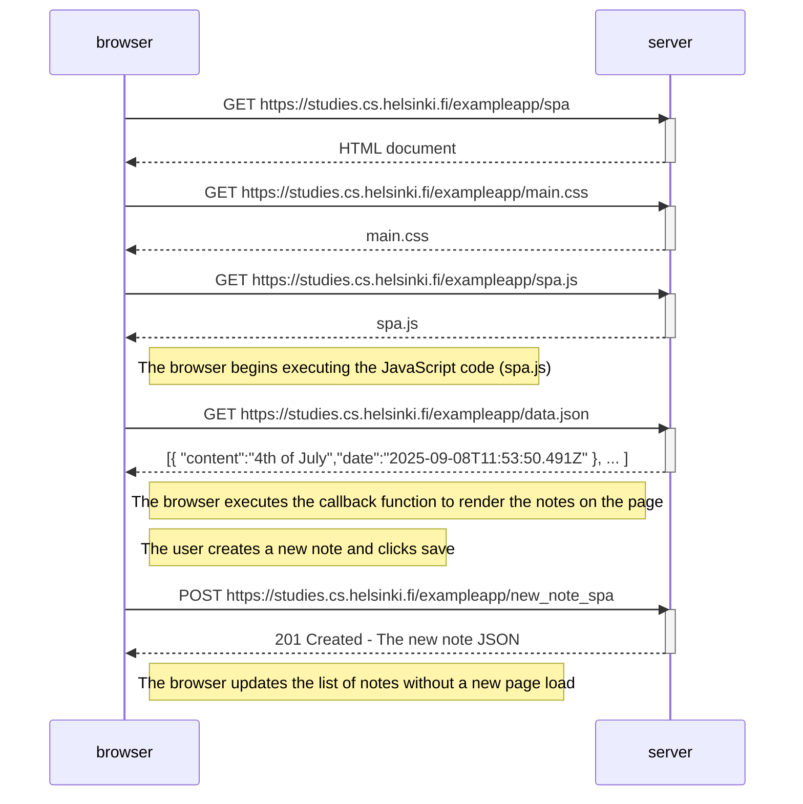

Part 4

```mermaid
sequenceDiagram
    participant browser
    participant server
    
    browser->>server: GET https://studies.cs.helsinki.fi/exampleapp/spa
    activate server
    server-->>browser: HTML document
    deactivate server
    
    browser->>server: GET https://studies.cs.helsinki.fi/exampleapp/main.css
    activate server
    server-->>browser: main.css
    deactivate server
    
    browser->>server: GET https://studies.cs.helsinki.fi/exampleapp/spa.js
    activate server
    server-->>browser: spa.js
    deactivate server
    
    Note right of browser: The browser begins executing the JavaScript code (spa.js)
    
    browser->>server: GET https://studies.cs.helsinki.fi/exampleapp/data.json
    activate server
    server-->>browser: [{ "content":"4th of July","date":"2025-09-08T11:53:50.491Z" }, ... ]
    deactivate server
    
    Note right of browser: The browser executes the callback function to render the notes on the page
    
    Note right of browser: The user creates a new note and clicks save
    
    browser->>server: POST https://studies.cs.helsinki.fi/exampleapp/new_note_spa
    activate server
    server-->>browser: 201 Created - The new note JSON
    deactivate server
    
    Note right of browser: The browser updates the list of notes without a new page load
```
