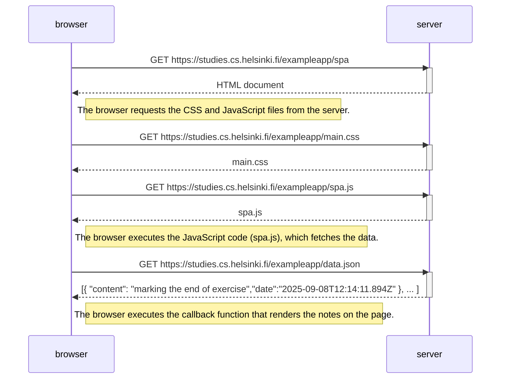

```mermaid
sequenceDiagram
    participant browser
    participant server
    
    browser->>server: GET https://studies.cs.helsinki.fi/exampleapp/spa
    activate server
    server-->>browser: HTML document
    deactivate server
    
    Note right of browser: The browser requests the CSS and JavaScript files from the server.
    
    browser->>server: GET https://studies.cs.helsinki.fi/exampleapp/main.css
    activate server
    server-->>browser: main.css
    deactivate server
    
    browser->>server: GET https://studies.cs.helsinki.fi/exampleapp/spa.js
    activate server
    server-->>browser: spa.js
    deactivate server
    
    Note right of browser: The browser executes the JavaScript code (spa.js), which fetches the data.
    
    browser->>server: GET https://studies.cs.helsinki.fi/exampleapp/data.json
    activate server
    server-->>browser: [{ "content": "marking the end of exercise","date":"2025-09-08T12:14:11.894Z" }, ... ]
    deactivate server
    
    Note right of browser: The browser executes the callback function that renders the notes on the page.
```
